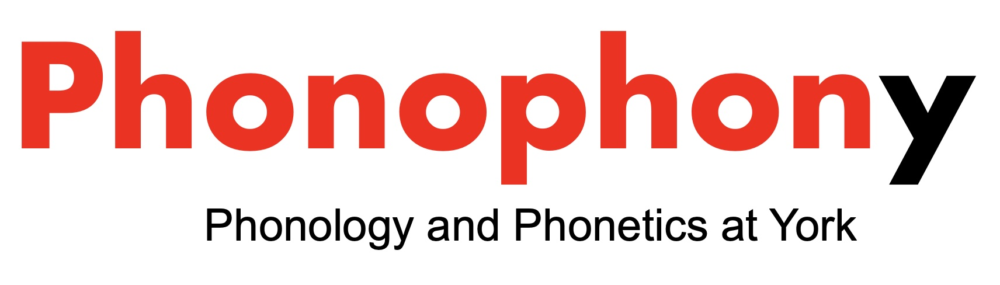

 

Fall 2024
\
Thursdays (see calendar below)\
Accolade East (ACE) Building, Rm. 010\
Coordinators: [Chandan Narayan](https://ch-narayan.github.io), [Thomas Kettig](https://tkettig.wixsite.com/home), [Emily Elfner](https://emilyelfner.info.yorku.ca/), [Liisa Duncan](https://profiles.laps.yorku.ca/profiles/liduncan/)\
\
\

### About

This is the landing site for the Phonophony group, an informal meeting of faculty and students interested in speech sounds. We meet once (or twice) a month to discuss our own research or to read interesting papers about phonology, phonetics, speech perception, acoustics, etc. We will occasionally invite visiting linguists to present their work to our group.

